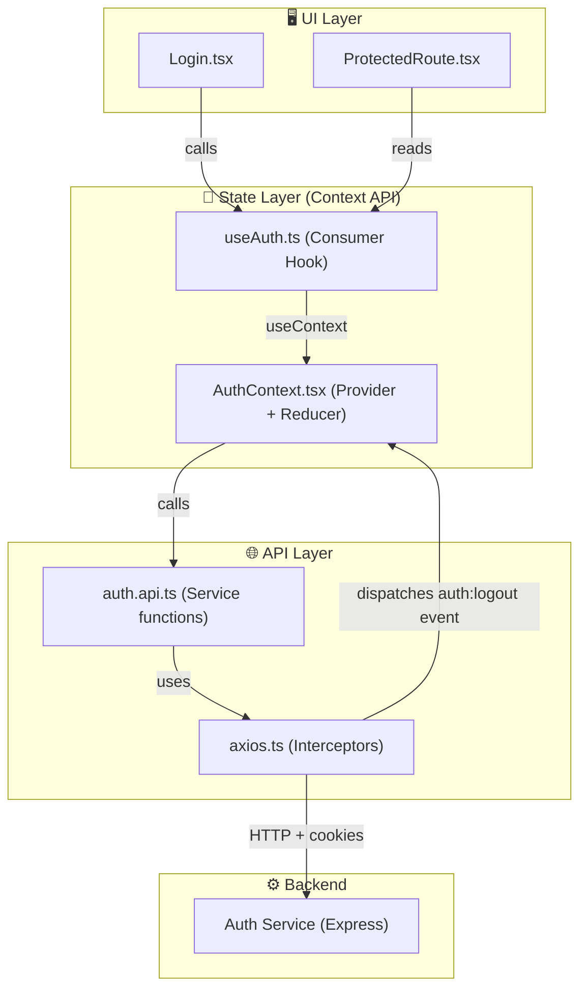
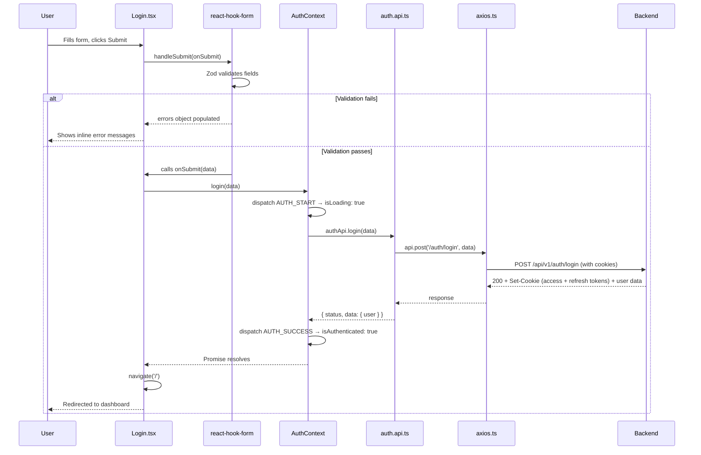
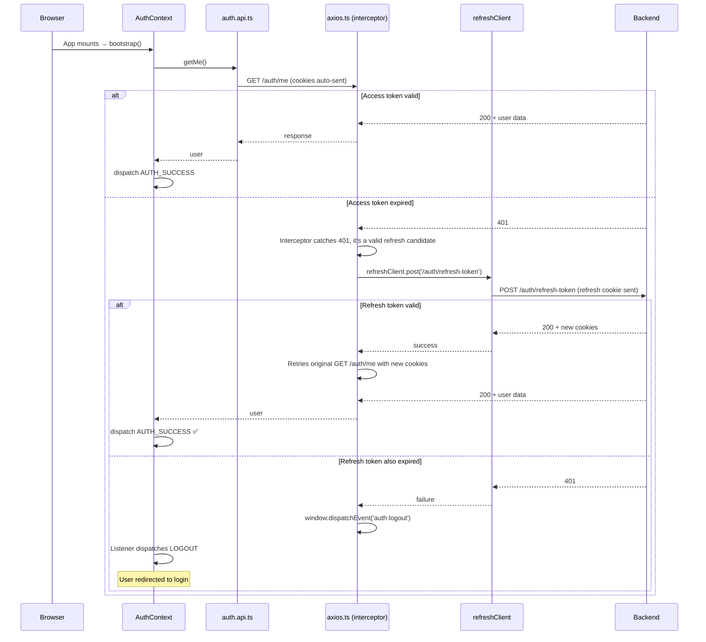

# 🔐 Fluxx Bite — Frontend Auth System Deep Dive

A **line-by-line** walkthrough of every auth-related frontend file, explaining the *what*, *why*, and *how* so you fully understand Context API, interceptors, and the login flow.

---

## Architecture Overview



**Data flows top-to-bottom**: UI → Hook → Context → API Service → Axios → Backend.
**Auth state flows bottom-to-top**: Backend response → Axios → Service → Context dispatch → Hook → UI re-render.

---

## File 1 — Types: [auth.types.ts](file:///d:/PERSONAL-PROJECTS/FLUXX-BITE/frontend/src/features/auth/types/auth.types.ts)

This is the **contract** every other file depends on.

```typescript
import { z } from 'zod';
import { loginSchema, registerSchema } from '../schemas/auth.schema';
```
- Imports `z` (the Zod library) and the two validation schemas. These schemas are used below to **derive TypeScript types automatically** — meaning you never hand-write form types. Change the schema → types update everywhere.

```typescript
export type UserRole = 'customer' | 'rider' | 'seller';
export type AuthProviderType = 'google' | 'local';
```
- **Union types** that restrict `role` and `provider` to known string values. Any typo becomes a compile error.

```typescript
export interface User {
  id: string;
  name: string;
  email: string;
  role: UserRole;
  image?: string;           // optional (Google users may have one)
  provider: AuthProviderType;
  createdAt: string;
}
```
- The shape of a logged-in user, matching what your backend returns under `response.data.user`.

```typescript
export interface AuthState {
  user: User | null;         // null = nobody logged in
  isAuthenticated: boolean;
  isLoading: boolean;        // true during bootstrap & API calls
  error: string | null;      // latest error message
}
```
- This is the **state shape** managed by `useReducer` inside the Context. Every component that calls `useAuth()` gets these four values.

```typescript
export type LoginFormData = z.infer<typeof loginSchema>;
export type RegisterFormData = z.infer<typeof registerSchema>;
```
- `z.infer` extracts the TypeScript type from a Zod schema at compile time. `LoginFormData` becomes `{ email: string; password: string }` automatically. **Single source of truth** — if you add a field to the schema, the type updates everywhere.

```typescript
export interface AuthContextType extends AuthState {
  login: (data: LoginFormData) => Promise<void>;
  register: (data: RegisterFormData) => Promise<void>;
  logout: () => Promise<void>;
  socialLogin: (response: any) => Promise<void>;
  clearError: () => void;
}
```
- The full Context shape: **state + actions**. `extends AuthState` means it includes `user`, `isAuthenticated`, etc. *plus* the five methods. This is what `useAuth()` returns.

---

## File 2 — Validation: [auth.schema.ts](file:///d:/PERSONAL-PROJECTS/FLUXX-BITE/frontend/src/features/auth/schemas/auth.schema.ts)

```typescript
import { z } from 'zod';

export const loginSchema = z.object({
    email: z.email('Invalid email'),
    password: z.string().min(6, 'Password must be at least 6 characters'),
});
```
- Creates a Zod **object schema** for login. `z.email()` validates email format. `z.string().min(6)` enforces minimum length. The string argument is the **error message** shown to the user.

```typescript
export const registerSchema = z.object({
    name: z.string().min(2, 'Name is required'),
    email: z.email('Invalid email'),
    password: z.string().min(6, 'Password must be at least 6 characters'),
});
```
- Same idea, but adds a `name` field. These schemas are used by `react-hook-form` via `zodResolver` in the Login component to do **client-side validation before any API call**.

---

## File 3 — API Layer: [auth.api.ts](file:///d:/PERSONAL-PROJECTS/FLUXX-BITE/frontend/src/features/auth/services/auth.api.ts)

This file is a **thin service layer** — pure functions that call the backend and return typed data.

```typescript
import api from '../../../api/axios';
```
- Imports the **pre-configured Axios instance** (the one with interceptors). Every call below automatically gets `withCredentials: true`, the base URL, and the token-refresh interceptor.

```typescript
import type { LoginFormData, RegisterFormData, User } from '../types/auth.types';
```
- Type imports for compile-time safety.

```typescript
export interface AuthResponse {
  status: string;
  data: {
    user: User;
  };
}
```
- Defines the expected **response shape** from your backend. Every auth endpoint returns `{ status: "success", data: { user: {...} } }`.

```typescript
export const login = async (data: LoginFormData): Promise<AuthResponse> => {
  const response = await api.post<AuthResponse>('/auth/login', data);
  return response.data;
};
```
- **`api.post<AuthResponse>('/auth/login', data)`**: Makes a POST request to `/auth/login`. The generic `<AuthResponse>` tells TypeScript what `response.data` looks like.
- **`return response.data`**: Axios wraps the HTTP body in `response.data`. So this unwraps one level — the caller gets `{ status, data: { user } }` directly.

> [!IMPORTANT]
> Because `api` has `withCredentials: true`, the browser automatically sends the HttpOnly cookies, and the backend can set new cookies (access/refresh tokens) on the response. **No manual token handling needed on the frontend.**

```typescript
export const register = async (data: RegisterFormData): Promise<AuthResponse> => {
  const response = await api.post<AuthResponse>('/auth/register', data);
  return response.data;
};
```
- Identical pattern, different endpoint and data shape (adds `name`).

```typescript
export const logout = async (): Promise<void> => {
  await api.post('/auth/logout');
};
```
- Calls logout. Backend clears cookies. Returns `void` (we don't need response data).

```typescript
export const getMe = async (): Promise<AuthResponse> => {
  const response = await api.get<AuthResponse>('/auth/me');
  return response.data;
};
```
- **Session persistence endpoint**. Called on app load to check "is there a valid session?". If the cookie is still valid, backend returns the user. If not, it 401s → interceptor tries to refresh → if refresh fails, `auth:logout` event fires.

```typescript
export const socialLogin = async (token: string): Promise<AuthResponse> => {
  const response = await api.post<AuthResponse>('/auth/social-login', { token });
  return response.data;
};
```
- Sends the Google auth code to the backend, which exchanges it for Google tokens and returns the user.

---

## File 4 — Axios Interceptors: [axios.ts](file:///d:/PERSONAL-PROJECTS/FLUXX-BITE/frontend/src/api/axios.ts)

This is the **most complex file** — it handles transparent token refresh. Let's go block by block.

### The Main Axios Instance

```typescript
import axios from 'axios';
import type { AxiosError, InternalAxiosRequestConfig } from 'axios';
```
- Imports the axios library and its types.

```typescript
interface RetryableRequest extends InternalAxiosRequestConfig {
  _retry?: boolean;
}
```
- Extends Axios's internal config type with a custom `_retry` flag. This boolean acts as a **guard against infinite retry loops** — if a request already failed once and was retried, don't retry again.

```typescript
const api = axios.create({
  baseURL: import.meta.env.VITE_API_BASE_URL || 'http://localhost:5000/api/v1',
  withCredentials: true,   // ← sends HttpOnly cookies with every request
  timeout: 10000,          // ← 10 second timeout (prevents hangs)
  headers: {
    'Content-Type': 'application/json',
  },
});
```
- Creates the **main Axios instance** used throughout the app.
- `withCredentials: true` is **critical**: it tells the browser to include cookies (your access/refresh tokens) in cross-origin requests. Without this, your tokens never get sent.
- `baseURL` means you only write `'/auth/login'` instead of the full URL.

### The Refresh Client (Loop Prevention)

```typescript
const refreshClient = axios.create({
  baseURL: import.meta.env.VITE_API_BASE_URL || 'http://localhost:5000/api/v1',
  withCredentials: true,
});
```

> [!CAUTION]
> This is a **separate Axios instance with NO interceptors**. This is the key anti-loop mechanism. If you used `api` to call `/auth/refresh-token`, and the refresh itself 401'd, the interceptor would try to refresh again → infinite loop. `refreshClient` sidesteps this entirely.

### Refresh State Management

```typescript
let isRefreshing = false;
```
- A **module-level lock**. When a refresh is in progress, this is `true`. Prevents multiple simultaneous refresh calls if several requests 401 at the same time.

```typescript
let failedQueue: {
  resolve: () => void;
  reject: (reason?: unknown) => void;
}[] = [];
```
- A queue of **pending promises**. When requests 401 while a refresh is already in progress, they get parked here instead of each one triggering its own refresh call.

```typescript
const processQueue = (error: AxiosError | null) => {
  failedQueue.forEach((p) => {
    error ? p.reject(error) : p.resolve();
  });
  failedQueue = [];
};
```
- After refresh completes (or fails), this resolves/rejects **all queued promises at once**, then empties the queue.

### Request Interceptor

```typescript
api.interceptors.request.use(
  (config) => config,          // pass-through (cookies handle auth)
  (error) => Promise.reject(error)
);
```
- Intentionally a **no-op**. Since auth is handled via HttpOnly cookies (automatically attached by the browser), there's no need to manually inject an `Authorization` header. This interceptor exists as a placeholder for future needs (e.g., adding a CSRF token).

### Response Interceptor (Token Refresh Logic)

This is where the magic happens — transparent token refresh.

```typescript
api.interceptors.response.use(
  (response) => response,     // ← success: just pass through
```
- If the response is 2xx, no intervention needed.

```typescript
  async (error: AxiosError) => {
    if (!error.config) return Promise.reject(error);  // safety guard
```
- On error, first check: does the error even have a `config` (the original request details)? If not (rare edge case), we can't retry, so just reject.

```typescript
    const originalRequest = error.config as RetryableRequest;

    const is401 = error.response?.status === 401;
    const isRetry = originalRequest._retry === true;
    const isRefreshEndpoint = originalRequest.url === '/auth/refresh-token';
```
- Cast to `RetryableRequest` so we can read/write `_retry`.
- Three boolean checks:
  - `is401` — was this a 401 Unauthorized?
  - `isRetry` — have we already retried this request?
  - `isRefreshEndpoint` — is this the refresh endpoint itself?

```typescript
    if (!is401 || isRetry || isRefreshEndpoint) {
      return Promise.reject(error);
    }
```
- **Bail out** if: it's not a 401, or we already retried, or it's the refresh endpoint failing. This prevents infinite loops and avoids refreshing on non-auth errors (like 404, 500).

```typescript
    originalRequest._retry = true;  // mark as retried
```
- Set the guard flag so this request can't trigger another refresh cycle.

#### Queueing Mechanism (Concurrent 401s)

```typescript
    if (isRefreshing) {
      return new Promise<void>((resolve, reject) => {
        failedQueue.push({ resolve, reject });
      })
        .then(() => api(originalRequest))    // retry after refresh
        .catch((err) => Promise.reject(err));
    }
```
- **If a refresh is already in progress**: don't start another one. Instead:
  1. Create a new Promise and park its `resolve`/`reject` in the queue.
  2. When `processQueue(null)` is called later, this promise resolves → `.then()` retries the original request.
  3. If `processQueue(error)` is called, this promise rejects → `.catch()` propagates the failure.

> [!TIP]
> **Why is this needed?** Imagine you're on a dashboard that makes 5 API calls simultaneously. If the access token expired, all 5 get 401 at roughly the same time. Without the queue, each one would attempt a `/auth/refresh-token` call — wasteful and potentially broken. With the queue, only **one** refresh happens, and then all 5 retry.

#### The Actual Refresh

```typescript
    isRefreshing = true;  // acquire the lock

    try {
      await refreshClient.post('/auth/refresh-token');
```
- Lock acquired, call the refresh endpoint using the **interceptor-free** `refreshClient`. The backend receives the HttpOnly refresh token cookie, validates it, issues new access + refresh cookies in the response.

```typescript
      processQueue(null);                    // unlock all queued requests (success)
      return api(originalRequest);           // retry the original failed request
```
- Refresh succeeded! Resolve all queued promises (they'll retry), then retry the original request too.

```typescript
    } catch (refreshError) {
      processQueue(refreshError as AxiosError);  // reject all queued
```
- Refresh failed (e.g., refresh token also expired). Reject everything.

```typescript
      window.dispatchEvent(new Event('auth:logout'));
```

> [!IMPORTANT]
> **The decoupled logout mechanism.** The Axios module can't import `AuthContext` (it would create a circular dependency). Instead, it fires a **custom DOM event** `'auth:logout'`. The `AuthContext` listens for this event and dispatches `LOGOUT` to clear state. This is a clean, decoupled pub/sub pattern.

```typescript
      return Promise.reject(refreshError);
    } finally {
      isRefreshing = false;  // always release the lock
    }
```
- `finally` ensures the lock is release whether refresh succeeded or failed.

```typescript
export default api;
```
- Export the configured instance. Every service file imports this.

---

## File 5 — AuthContext: [AuthContext.tsx](file:///d:/PERSONAL-PROJECTS/FLUXX-BITE/frontend/src/features/auth/context/AuthContext.tsx)

This is the **brain** of the auth system — all state lives here.

### Initial State

```typescript
const initialState: AuthState = {
  user: null,
  isAuthenticated: false,
  isLoading: true,       // starts true because we need to check for an existing session
  error: null,
};
```
- `isLoading: true` on startup is intentional — while the app checks `/auth/me` (bootstrap), we don't know if the user is logged in yet. The `ProtectedRoute` shows a spinner during this time instead of falsely redirecting to login.

### Action Types (The Reducer Pattern)

```typescript
type AuthAction =
  | { type: 'AUTH_START' }
  | { type: 'AUTH_SUCCESS'; payload: User }
  | { type: 'AUTH_FAILURE'; payload: string }
  | { type: 'LOGOUT' }
  | { type: 'CLEAR_ERROR' };
```
- A **discriminated union** of all possible state transitions. TypeScript ensures:
  - `AUTH_SUCCESS` *must* carry a `User` payload
  - `AUTH_FAILURE` *must* carry a `string` (error message)
  - You can't dispatch an action that doesn't match one of these shapes

### The Reducer (Pure State Machine)

```typescript
const authReducer = (state: AuthState, action: AuthAction): AuthState => {
  switch (action.type) {
    case 'AUTH_START':
      return { ...state, isLoading: true, error: null };
```
- Spread current state, set loading, clear any previous error. This triggers "Validating..." in the submit button.

```typescript
    case 'AUTH_SUCCESS':
      return {
        ...state,
        isLoading: false,
        isAuthenticated: true,
        user: action.payload,
        error: null,
      };
```
- Login/register/bootstrap succeeded. Stores the user, marks authenticated. This triggers `ProtectedRoute` to show the children instead of redirecting.

```typescript
    case 'AUTH_FAILURE':
      return {
        ...state,
        isLoading: false,
        isAuthenticated: false,
        user: null,
        error: action.payload,
      };
```
- Clears user, stores the error message. Any component reading `error` from context can display it.

```typescript
    case 'LOGOUT':
      return {
        ...initialState,
        isLoading: false,   // override: don't show spinner after logout
      };
```
- Reset to initial state but with `isLoading: false` (we know the user is logged out, no need to check).

```typescript
    case 'CLEAR_ERROR':
      return { ...state, error: null };
    default:
      return state;
  }
};
```

> [!NOTE]
> **Why `useReducer` instead of `useState`?** With 4 state fields that must change together atomically, `useReducer` prevents impossible states. For example, you'll never accidentally have `isAuthenticated: true` with `user: null` — the reducer guarantees consistent transitions.

### Creating the Context

```typescript
export const AuthContext = createContext<AuthContextType | undefined>(undefined);
```
- Creates the React Context with a type of `AuthContextType | undefined`. The `undefined` default is intentional — it lets `useAuth()` detect if it's called **outside** of an `AuthProvider` and throw a helpful error.

### The Provider Component

```typescript
export const AuthProvider: React.FC<{ children: ReactNode }> = ({ children }) => {
  const [state, dispatch] = useReducer(authReducer, initialState);
```
- `useReducer` returns the current state and a `dispatch` function. `dispatch({ type: 'AUTH_SUCCESS', payload: user })` triggers the reducer to compute the next state.

#### Bootstrap (Session Persistence)

```typescript
  const bootstrap = useCallback(async () => {
    try {
      const response = await authApi.getMe();
      if (response.data.user) {
        dispatch({ type: 'AUTH_SUCCESS', payload: response.data.user });
      }
    } catch (err) {
      dispatch({ type: 'AUTH_FAILURE', payload: 'Session expired' });
    }
  }, []);
```
- **`bootstrap`** checks if the user already has a valid session when the app loads.
- Calls `GET /auth/me` → backend reads the access token cookie → returns user data.
- If successful → dispatches `AUTH_SUCCESS` (user is logged in without re-entering credentials).
- If it fails → dispatches `AUTH_FAILURE` (user needs to log in).
- `useCallback(fn, [])` memoizes the function so it's referentially stable and doesn't cause unnecessary re-renders.

> [!TIP]
> **What if the access token is expired but the refresh token is valid?** The `GET /auth/me` call will 401 → the Axios response interceptor catches it → calls `/auth/refresh-token` → gets new cookies → retries `/auth/me` → succeeds → user is still logged in! All transparent.

```typescript
  useEffect(() => {
    bootstrap();
  }, [bootstrap]);
```
- Runs `bootstrap` once on mount (initial page load / hard refresh).

#### Listening for Forced Logout

```typescript
  useEffect(() => {
    const handleLogout = () => {
      dispatch({ type: 'LOGOUT' });
    };

    window.addEventListener('auth:logout', handleLogout);
    return () => window.removeEventListener('auth:logout', handleLogout);
  }, []);
```
- Remembers the `auth:logout` event from `axios.ts`? This is the **listener**. When the refresh token also fails, the interceptor fires `auth:logout` → this listener dispatches `LOGOUT` → state resets → `ProtectedRoute` redirects to login.
- The `return` cleanup function removes the listener when the Provider unmounts (prevents memory leaks).

#### Action Methods

```typescript
  const login = async (data: LoginFormData) => {
    dispatch({ type: 'AUTH_START' });           // show spinner
    try {
      const response = await authApi.login(data);
      dispatch({ type: 'AUTH_SUCCESS', payload: response.data.user }); // store user
      toast.success('Welcome back!');
    } catch (error: any) {
      const message = error.response?.data?.message || 'Login failed';
      dispatch({ type: 'AUTH_FAILURE', payload: message });
      toast.error(message);
      throw error;   // re-throw so Login component's catch block can run
    }
  };
```
- **The flow**: `AUTH_START` → API call → `AUTH_SUCCESS` or `AUTH_FAILURE` + toast notification.
- `throw error` at the end is important — the Login component has its own `try/catch` that needs to know if login failed (to prevent navigation).

The `register`, `socialLogin` methods follow the exact same pattern.

```typescript
  const logout = async () => {
    try {
      await authApi.logout();            // tell backend to clear cookies
      dispatch({ type: 'LOGOUT' });      // clear local state
      toast.success('Logged out successfully');
    } catch (error) {
      dispatch({ type: 'LOGOUT' });      // still clear locally even if server fails
    }
  };
```
- Always dispatches `LOGOUT` locally, even if the server call fails. This ensures the user is never "stuck" in an authenticated state on the frontend.

#### Providing the Context

```typescript
  return (
    <AuthContext.Provider
      value={{
        ...state,          // user, isAuthenticated, isLoading, error
        login,
        register,
        logout,
        socialLogin,
        clearError,
      }}
    >
      {children}
    </AuthContext.Provider>
  );
};
```
- Spreads state + methods into the context value. Every component inside `<AuthProvider>` can access these via `useAuth()`.

---

## File 6 — useAuth Hook: [useAuth.ts](file:///d:/PERSONAL-PROJECTS/FLUXX-BITE/frontend/src/features/auth/hooks/useAuth.ts)

```typescript
import { useContext } from 'react';
import { AuthContext } from '../context/AuthContext';
import type { AuthContextType } from '../types/auth.types';
```

```typescript
export const useAuth = (): AuthContextType => {
  const context = useContext(AuthContext);
  
  if (context === undefined) {
    throw new Error('useAuth must be used within an AuthProvider');
  }
  
  return context;
};
```

**Why this wrapper exists instead of using `useContext(AuthContext)` directly:**

1. **Type narrowing**: `useContext(AuthContext)` returns `AuthContextType | undefined`. The `if` check filters out `undefined`, so the return type is just `AuthContextType`. Consumers never have to null-check.
2. **Developer error detection**: If someone uses `useAuth()` outside of `<AuthProvider>`, they get a clear error message instead of mysterious `undefined` crashes.
3. **Single import**: Components import `useAuth` instead of both `useContext` and `AuthContext`.

---

## File 7 — Login Component: [Login.tsx](file:///d:/PERSONAL-PROJECTS/FLUXX-BITE/frontend/src/features/auth/components/Login.tsx)

### Setup

```typescript
const Login = () => {
  const navigate = useNavigate();
  const { login, register: registerUser, socialLogin, isLoading: authLoading } = useAuth();
  const [isLogin, setIsLogin] = useState(true);
```
- `useNavigate()` — React Router hook for programmatic navigation.
- `useAuth()` — pulls auth methods and loading state from context. Note `register` is renamed to `registerUser` to avoid collision with react-hook-form's `register` function.
- `isLogin` — toggles between login and registration mode.

### Form Handling

```typescript
  const {
    register,
    handleSubmit,
    formState: { errors },
  } = useForm<LoginFormData | RegisterFormData>({
    resolver: zodResolver(isLogin ? loginSchema : registerSchema),
  });
```
- `useForm` is from `react-hook-form`. 
- `register` — function to connect input fields to the form state (e.g., `{...register('email')}`).
- `handleSubmit` — wraps your submit handler with validation; only calls your function if all fields pass Zod validation.
- `errors` — object containing validation error messages per field.
- `zodResolver(isLogin ? loginSchema : registerSchema)` — dynamically switches validation rules based on whether you're in login or register mode.

### Submit Handler

```typescript
  const onSubmit = async (data: LoginFormData | RegisterFormData) => {
    try {
      if (isLogin) {
        await login(data as LoginFormData);       // calls AuthContext.login
      } else {
        await registerUser(data as RegisterFormData); // calls AuthContext.register
      }
      navigate('/');   // go to home on success
    } catch (error) {
      // Errors are handled by the context/toast — no action needed here
      // But the catch prevents `navigate('/')` from running on failure
    }
  };
```

> [!NOTE]
> The `try/catch` here isn't for showing errors (the context already does that with `toast`). It's to **prevent `navigate('/')`** from running when login fails. Without the catch, the `await` would throw, causing an unhandled promise rejection.

### Google Login

```typescript
  const handleGoogleLogin = useGoogleLogin({
    onSuccess: async (tokenResponse) => {
      try {
        const { code } = tokenResponse;    // the authorization code from Google
        await socialLogin(code);            // send it to your backend
        navigate('/');
      } catch (error) {
        // Errors handled by context
      }
    },
    flow: 'auth-code',   // use the Authorization Code flow (more secure than implicit)
  });
```
- `useGoogleLogin` from `@react-oauth/google` opens the Google consent screen.
- `flow: 'auth-code'` means Google returns an authorization **code** (not a token). Your backend exchanges this code for Google tokens server-side — more secure because tokens never touch the browser.

### The JSX/UI (summarised — the visual layout is secondary to the logic)

- **Form** → `onSubmit={handleSubmit(onSubmit)}` — react-hook-form validates first, then calls `onSubmit`.
- **Inputs** → `{...register('email')}` connects each input to react-hook-form.
- **Error display** → `{errors.email && <p>{errors.email.message}</p>}` shows Zod validation errors inline.
- **Submit button** → disabled while `authLoading` is true, shows spinner.
- **Google button** → `onClick={() => handleGoogleLogin()}` triggers the OAuth flow.
- **Mode toggle** → `setIsLogin(!isLogin)` switches between login/register form.

---

## File 8 — Protected Route: [ProtectedRoute.tsx](file:///d:/PERSONAL-PROJECTS/FLUXX-BITE/frontend/src/components/common/ProtectedRoute.tsx)

```typescript
const ProtectedRoute: React.FC<ProtectedRouteProps> = ({ children, allowedRoles }) => {
  const { isAuthenticated, isLoading, user } = useAuth();
  const location = useLocation();
```
- Reads auth state via `useAuth()` and the current URL via `useLocation()`.

```typescript
  if (isLoading) {
    return (
      <div className="flex items-center justify-center min-h-screen">
        <div className="animate-spin rounded-full h-12 w-12 border-t-2 border-b-2 border-primary-600"></div>
      </div>
    );
  }
```
- While bootstrap is running (`isLoading: true`), show a spinner. **This prevents the flash-redirect problem** — without it, the route would see `isAuthenticated: false` on first render and redirect to login, even if the user has a valid session.

```typescript
  if (!isAuthenticated) {
    return <Navigate to="/login" state={{ from: location }} replace />;
  }
```
- Not authenticated → redirect to login. `state={{ from: location }}` saves the original URL. After login, you could read this with `useLocation()` and redirect back to where they were trying to go.
- `replace` replaces the history entry (so pressing back doesn't land on the protected page again).

```typescript
  if (allowedRoles && user && !allowedRoles.includes(user.role)) {
    return <Navigate to="/" replace />;
  }
```
- **Role-based access control**. If you wrap a route with `<ProtectedRoute allowedRoles={['seller']}>`, only users with `role: 'seller'` can access it.

```typescript
  return <>{children}</>;
```
- All checks passed → render the protected content.

---

## Complete Login Flow (End-to-End)

Here's what happens when a user types their email/password and clicks "Sign In":



## Session Persistence (Page Refresh)



---

## Key Concepts Summary

| Concept | What It Does | Where |
|---|---|---|
| **Context API** | Global state container for auth data | `AuthContext.tsx` |
| **useReducer** | Manages predictable state transitions (like a mini-Redux) | `AuthContext.tsx` |
| **Axios Interceptor** | Catches 401s and transparently refreshes tokens | `axios.ts` |
| **Request Queue** | Batches concurrent 401s into a single refresh call | `axios.ts` |
| **Custom DOM Event** | Decouples Axios from React (no circular imports) | `axios.ts` → `AuthContext.tsx` |
| **Bootstrap** | Checks for existing session on app load | `AuthContext.tsx` |
| **HttpOnly Cookies** | Tokens stored securely by browser, never in JS memory | Backend sets, Axios sends via `withCredentials` |
| **Zod + react-hook-form** | Single-source schema for validation + TS types | `auth.schema.ts` → `Login.tsx` |
| **ProtectedRoute** | Route guard with loading state + role-based access | `ProtectedRoute.tsx` |
